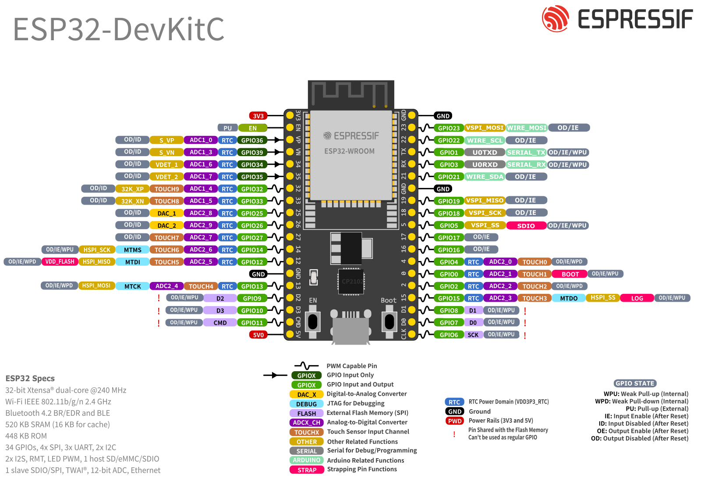
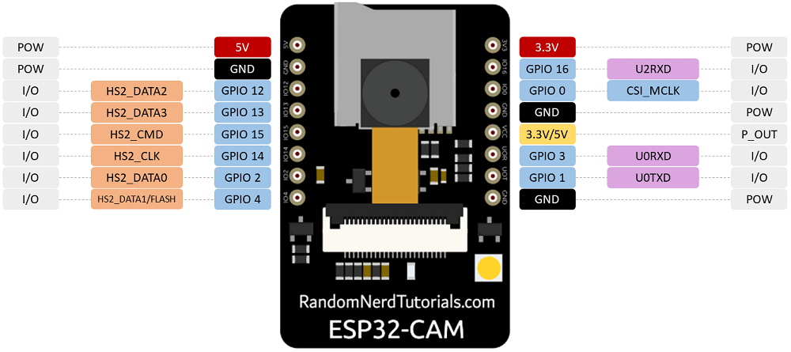
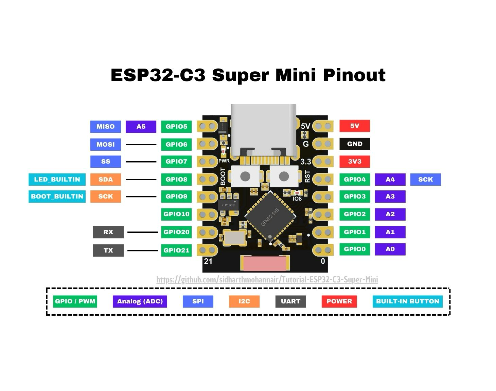
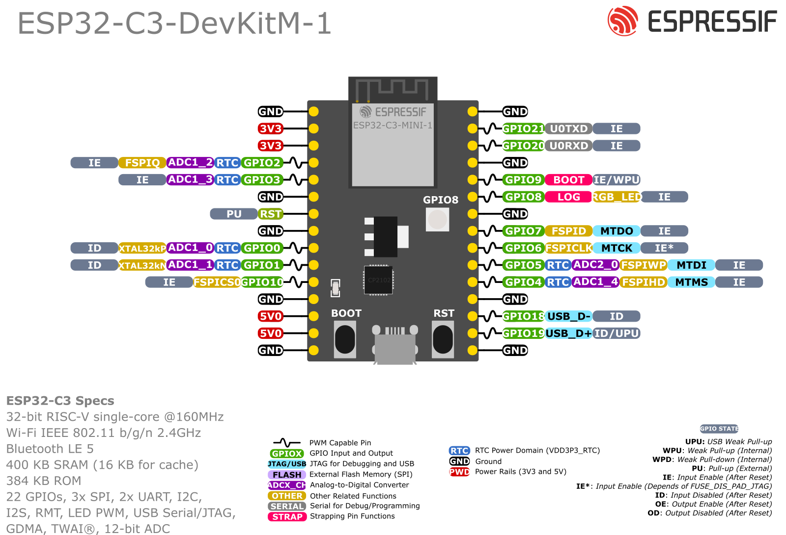

# Pinout & wiring (ESP32-DevKitC, AI-Thinker ESP32-CAM, ESP32-C3)

Wiring reference for the BC250 power switch on:
- **ESP32-DevKitC (38-pin, ESP32-WROOM-32)**: Classic Bluetooth wake
- **AI-Thinker ESP32-CAM (ESP-32S module)**: Classic Bluetooth wake
- **ESP32-C3 (SuperMini / DevKitM-1)**: Bluetooth Low Energy (BLE) wake

Pin numbers live in [include/board.h](../include/board.h) — conditionally selected by the
active PlatformIO environment (`esp32dev`, `esp32cam`, or `esp32-c3-devkitm-1`).

## GPIO assignment

| Signal | DevKitC | ESP32-CAM | ESP32-C3 | Connects to | Notes |
|--------|---------|-----------|----------|-------------|-------|
| `BUTTON_SENSE` | **GPIO25** | **GPIO15** | **GPIO5** | Momentary switch, terminal A | Internal pull-up; pressed reads LOW |
| `BUTTON_GND` | **GPIO26** | **GND** | **GPIO6** | Momentary switch, terminal B | DevKitC/C3 drives LOW; CAM wires to header GND |
| `PS_ON_PIN` | **GPIO32** | **GPIO14** | **GPIO4** | ATX `PS_ON#` (green wire) | **Open-drain**, active LOW: LOW = PSU on, released = off |
| `BOARD_SENSE` | **GPIO34** | **GPIO13** | **GPIO3** | BC250 `TPMS1` pin 9 | ~3.3 V when up, 0 when off (DevKitC/C3: ADC with hysteresis; CAM: digital INPUT_PULLDOWN) |
| `FLASH_LED` | — | **GPIO4** | — | Onboard white LED | Flashes 500 ms when controller wakes the PC |
| `5V` / `VIN` | **5V** | **5V** | **5V** | PSU `+5VSB` | Permanent power for the ESP |
| `GND` | **GND** | **GND** | **GND** | PSU GND + board GND | Common ground |

### Pin rationale

**On ESP32 DevKitC:**
- **GPIO34 is ADC1** (ADC1_CH6). ADC2 can't be read while WiFi is running (setup portal), so the analog board-sense must be on ADC1. GPIO34 is input-only.
- **GPIO32** is high-impedance at reset, so `PS_ON#` stays released (PSU off) while the ESP32 boots. Not a strapping pin.
- **GPIO25/26** are general GPIOs with no boot-time function.

**On ESP32-C3 (SuperMini / DevKitM-1):**
- **GPIO3 is ADC1** (ADC1_CH3). Read as an analog voltage with factory eFuse calibration.
- **GPIO4** is open-drain for `PS_ON#`.
- **GPIO5/6** connect to the momentary switch.
- USB-CDC is built-in (`ARDUINO_USB_MODE=1`, `ARDUINO_USB_CDC_ON_BOOT=1`).

**On AI-Thinker ESP32-CAM:**
- Almost all GPIOs are taken by the camera, SD card socket, flash LED, and PSRAM.
- **GPIO13** is used for `BOARD_SENSE` as a digital input with internal pull-down (`INPUT_PULLDOWN`). All ADC1 pins (GPIO32–39) are internally dedicated to the camera or red LED. ADC2 cannot be sampled when Bluetooth or WiFi is active, and GPIO13 is shared with the SD DAT3 line which floats HIGH unless pulled down.
- **GPIO14** is free from strapping functions and used as open-drain for `PS_ON#`.
- **GPIO15** has an internal pull-up and is used for `BUTTON_SENSE`. Terminal B connects directly to the header `GND` pin (saving a GPIO pin).
- **GPIO4** drives the onboard high-power white LED (500 ms indicator pulse when controller wake is triggered).
- **Pins avoided on ESP32-CAM**:
  - `GPIO12`: Strapping pin MTDI (if pulled HIGH at boot by 3.3 V TPMS1, sets flash VDD to 1.8 V and prevents boot).
  - `GPIO16`: Connected to the external PSRAM chip CS line.
  - `GPIO0`: Boot mode strapping pin (must be LOW to flash, HIGH to boot).

## DevKitC header (left column, USB at the bottom)



All four signals and power are on the **left** header (the side with `EN`, `VP`, `VN`):

```
   ┌────────────────────────────┐
   │ 3V3                        │
   │ EN                         │
   │ IO36 (VP)                  │
   │ IO39 (VN)                  │
   │ IO34   ◄── TPMS1 pin 9     │  ADC1, input-only
   │ IO35                       │
   │ IO32   ──► PS_ON#          │  open-drain, active LOW
   │ IO33                       │
   │ IO25   ◄── switch A        │  pull-up
   │ IO26   ──► switch B        │  driven LOW
   │ IO27                       │
   │ IO14                       │
   │ IO12   (strapping, avoid)  │
   │ GND    ◄── common ground   │
   │ IO13                       │
   │ SD2 / SD3 / CMD  (flash)   │  leave unconnected
   │ 5V     ◄── PSU +5VSB       │
   └────────────────────────────┘
```

> Header order can differ slightly between DevKitC clones. **Go by the silkscreen labels**
> (`IO25`, `IO26`, `IO32`, `IO34`, `5V`, `GND`), not the physical position.

## AI-Thinker ESP32-CAM header



The ESP32-CAM has two 8-pin headers (antenna at top):

```
         ┌─────────────────────────┐
         │       [ Antenna ]       │
         │                         │
         │ IO12               3V3  │
         │ IO13 ◄─ TPMS1 pin 9 GND │
         │ IO15 ◄─ switch A   IO0  │  (IO0 to GND to flash)
         │ IO14 ──► PS_ON#    U0TX │
         │ IO2                U0RX │
         │ IO4  (flash LED)   IO16 │  (PSRAM)
         │ GND  ◄─ common/swB GND  │
         │ 5V   ◄─ PSU +5VSB  VCC  │
         └─────────────────────────┘
```

## ESP32-C3 SuperMini header (USB-C)



The ultra-compact ESP32-C3 SuperMini board features a built-in USB-C port and two 8-pin headers (USB-C at top):

```
           ┌────────────────────────┐
           │       [ USB-C ]        │
           │                        │
     IO5   │ ◄─ switch A (pull-up)  │ 5V   ◄─ PSU +5VSB
     IO6   │ ──► switch B (driven L)│ GND  ◄─ common ground
     IO7   │                        │ 3V3
     IO8   │ (blue LED)             │ IO4  ──► PS_ON# (open-drain)
     IO9   │ (BOOT button)          │ IO3  ◄─ TPMS1 pin 9 (ADC1)
    IO10   │                        │ IO2
    IO20   │                        │ IO1
    IO21   │                        │ IO0
           └────────────────────────┘
```

## ESP32-C3 DevKitM-1 header



The ESP32-C3-DevKitM-1 development board has two 15-pin headers (antenna at top, USB at bottom):

```
           ┌─────────────────────────────┐
           │         [ Antenna ]         │
           │                             │
       GND │                             │ GND
       3V3 │                             │ IO21 (TX)
       3V3 │                             │ IO20 (RX)
       IO2 │                             │ GND
IO3 (ADC1) │ ◄─ TPMS1 pin 9              │ IO9  (BOOT)
       GND │                             │ IO8  (RGB)
       RST │                             │ GND
       GND │                             │ IO7
       IO0 │                             │ IO6  ──► switch B (driven LOW)
       IO1 │                             │ IO5  ◄── switch A (pull-up)
      IO10 │                             │ IO4  ──► PS_ON# (open-drain)
       GND │                             │ GND
        5V │ ◄─ PSU +5VSB                │ IO18 (USB D-)
        5V │                             │ IO19 (USB D+)
       GND │ ◄─ common ground            │ GND
           │          [ USB ]            │
           └─────────────────────────────┘
```

## Connections

```
 PSU +5VSB ────────────────────────► ESP32 5V / VIN
 PSU GND ──────────────────────────► ESP32 GND  (common ground, also to the BC250)

 Switch terminal A ────────────────► DevKitC: GPIO25 | CAM: GPIO15 | C3: GPIO5  (pull-up)
 Switch terminal B ────────────────► DevKitC: GPIO26 | CAM: GND    | C3: GPIO6  (driven LOW / GND)

 PSU PS_ON# (green) ──[optional buffer, see below]── DevKitC: GPIO32 | CAM: GPIO14 | C3: GPIO4  (open-drain, active LOW)

 BC250 TPMS1 pin 9 ────────────────► DevKitC: GPIO34 | CAM: GPIO13 | C3: GPIO3  (3.3V board sense)
```

### `PS_ON#` 5 V caution (recommended buffer)

`PS_ON#` idles at ~5 V, pulled up **inside the PSU**. Open-drain firmware means the
ESP32 never *drives* 5 V, but the pin still *sees* 5 V whenever it's released, and
that is above the ESP32 GPIO absolute maximum (VDD + 0.3 V ≈ 3.6 V). It tends to work,
but it stresses the pad over time. Recommended fix — use a small low-side switch so the
ESP32 only ever drives a 3.3 V gate:

```
                                  PSU PS_ON# (green)
                                         │
                                         ├───────────  (PSU pull-up to ~5V is internal)
                                         │
                                       ┌─┴─┐
                    1 kΩ                │ D │   2N7000 / BSS138 N-MOSFET
 GPIO32 ──[ 1 kΩ ]──────────────────── │ G │   (or any small NPN: 1 kΩ base resistor,
                                        │ S │    emitter to GND)
                                       └─┬─┘
                                         │
                                        GND

 + 100 kΩ from gate to GND so PS_ON# stays released while the ESP32 boots.
```

The buffer **inverts** the signal: GPIO32 HIGH turns the MOSFET on and pulls `PS_ON#`
LOW (PSU on). If you add it, flip the logic levels in
[include/board.h](../include/board.h):

```cpp
const int PS_ON_ASSERT  = HIGH;  // MOSFET on  -> PS_ON# pulled LOW -> PSU on
const int PS_ON_RELEASE = LOW;   // MOSFET off -> PSU pull-up wins  -> PSU off
```

and change `pinMode(PS_ON_PIN, OUTPUT_OPEN_DRAIN)` to `OUTPUT` in
[src/main.cpp](../src/main.cpp) and [src/portal.cpp](../src/portal.cpp). If you skip the
buffer, at minimum put a ~1 kΩ series resistor between `PS_ON#` and GPIO32 to limit
the clamp-diode current.

## Connector pinouts

**ATX 24-pin main connector** — tap three pins:

```
               +3.3V ─┤  1 │ 13 ├─ +3.3V
               +3.3V ─┤  2 │ 14 ├─ −12V
                 GND ─┤  3 │ 15 ├─ GND
                 +5V ─┤  4 │ 16 ├─ PS_ON#   ◄── GPIO32 (green, open-drain, active LOW)
                 GND ─┤  5 │ 17 ├─ GND      ◄── ESP GND (any GND pin works)
                 +5V ─┤  6 │ 18 ├─ GND
                 GND ─┤  7 │ 19 ├─ GND
              PWR_OK ─┤  8 │ 20 ├─ (RSVD)
ESP 5V/VIN ◄── +5VSB ─┤  9 │ 21 ├─ +5V
                +12V ─┤ 10 │ 22 ├─ +5V
                +12V ─┤ 11 │ 23 ├─ +5V
               +3.3V ─┤ 12 │ 24 ├─ GND
```

**TPMS1 header** — single pin for board-power sense:

```
   PCICLK ─┤  1   2 ├─ GND
    FRAME ─┤  3   4 ├─ SMB_CLK_MAIN
  PCIRST# ─┤  5   6 ├─ SMB_DATA_MAIN
     LAD3 ─┤  7   8 ├─ LAD2
       3V ─┤  9  10 ├─ LAD1      ◄── pin 9 (3V) = board-on sense ──► GPIO34
     LAD0 ─┤ 11  12 ├─ GND
          ─┤     14 ├─ S_PWRDWN#
     3VSB ─┤ 15  16 ├─ SERIRQ#
      GND ─┤ 17  18 ├─ GND
```

Pin 9 is the only TPMS1 pin used: it reads ~3.3 V when the board is powered and 0 V
when off. No ground wire is needed from this header — the ESP32 already shares ground
with the board through the ATX connector.

`TPMS1` is a higher-impedance signal that hovers near the logic threshold, so it is read
as an **analog** voltage (16× oversampled, with hysteresis) rather than a digital pin.

## Powering and flashing

- Power the ESP32 from `+5VSB` into the `5V` (VIN) pin so it runs whether the machine is
  on or off. Don't connect USB and `+5VSB` at the same time without a diode/ideal-diode
  between them, or the two 5 V sources will fight.
- The DevKitC's USB-UART bridge (CP210x/CH340) is used for flashing and the serial log
  (115200 baud). No `BOOT`/`EN` button handling is needed on most boards; if upload
  fails to connect, hold `BOOT` while it says `Connecting...`.
- For the **ESP32-CAM**, use an external USB-to-UART adapter (or ESP32-CAM-MB daughterboard)
  connected to `U0TX` and `U0RX`. Jumper **`IO0` to `GND`** before powering on to enter
  flashing mode; disconnect `IO0` from `GND` and reset the module to boot the firmware.
